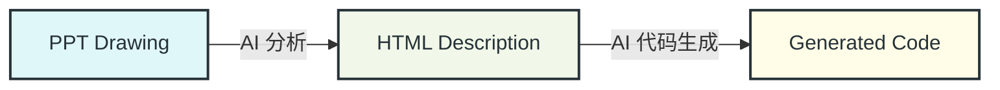
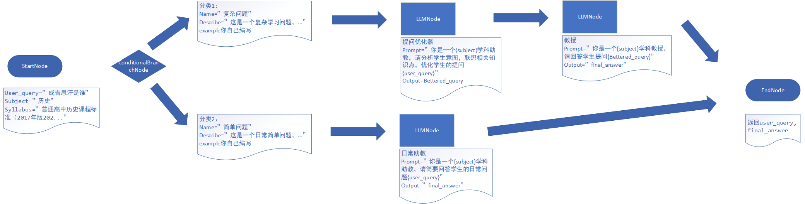

# 线性多Agent工作流框架

## 项目简介

这是一个简单、可扩展的基础框架，用于实现线性的多Agent工作流。该框架使用抽象类定义核心组件（节点），允许用户通过继承这些抽象类来创建具体的工作流节点。框架管理节点间的执行顺序和数据（上下文）传递。

## 项目结构

```
smart_education/
├── docs/                              # 文档目录
│   ├── user/                          # 用户指南
│   ├── developer/                     # 开发者文档
│   └── ai_reference/                  # AI参考工作流
├── examples/                          # 示例代码
│   ├── simple_nodes/                  # 简单节点示例
│   ├── ai_reference_workflows/        # AI参考工作流示例
│   └── advanced_workflows/            # 高级工作流示例
├── src/                               # 源代码
│   ├── workflow/                      # 工作流核心逻辑
│   │   ├── base.py                    # 基础节点定义
│   │   ├── engine.py                  # 工作流引擎
│   │   └── nodes/                     # 各种节点实现
│   └── llm/                           # LLM客户端
├── README.md                          # 项目简介和设计文档
└── requirements.txt                   # 项目依赖
```

## 快速上手，创建一个你自己的工作流

### 工作流程概览


### PPT绘图

示例图片：



### 改用html描述

**提示词**：
阅读并理解图片所描述的工作流，按照html设计文档示例 {[迭代工作流设计示例](examples/ai_reference_workflows/iterative_text_improvement.html)} 或 {[条件分支与子工作流设计](examples/ai_reference_workflows/subworkflow_mood_dialogue.html)} 和 {[ai_reference](docs/ai_reference/ai_reference.md)} 中的设计规范，生成html设计文档。

**示例代码**：
```html
<Workflow>
    <StartNode id="start" name="StartNode">
        <Output>
            <!-- 用户输入的问题，如'成吉思汗是谁' -->
            <Variable name="User_query" />
            <!-- 学科，如'历史' -->
            <Variable name="Subject" />
            <!-- 课程标准，如'普通高中历史课程标准（2017年版2022年修订）' -->
            <Variable name="Syllabus" />
        </Output>
    </StartNode>
        <!-- 后续省略 -->
```

[查看完整html设计](docs/assets/example/design.html)

此后，可以对html设计文档进行*修改和迭代*，直到达到满意的效果。

### 生成代码
提示词：
根据{html设计文档}，参考现有示例代码 {[迭代工作流设计示例](examples/ai_reference_workflows/iterative_text_improvement.py)} 或 {[条件分支与子工作流设计](examples/ai_reference_workflows/subworkflow_mood_dialogue.py)} 生成python代码。

示例代码：

```python
# 开始节点
    start_node = StartNode(
        node_id="start", 
        node_name="Start Node", 
        output_variable_names=["User_query", "Subject", "Syllabus"]
    )
    # 后续省略
    ...
```
[查看完整python代码](docs/assets/example/educational_workflow_example.py)