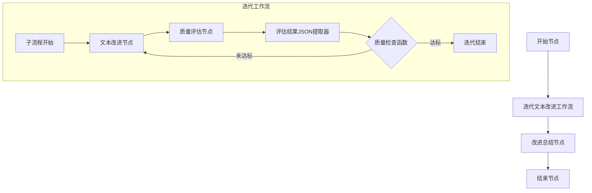
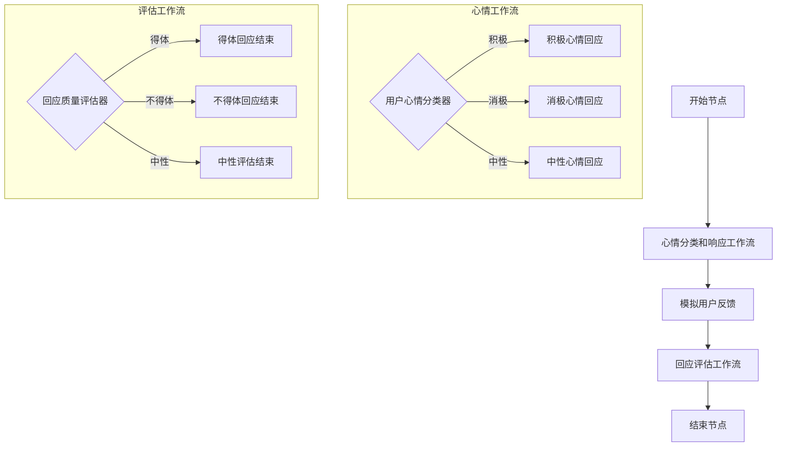

# AI 参考工作流

本目录包含两个AI工作流设计示例，可用作自定义工作流开发的参考。这些工作流展示了不同的设计模式和技术，帮助开发者理解如何构建复杂的AI交互流程。

## 工作流概览

### 1. 迭代文本改进工作流

这个工作流展示了如何逐步优化文本内容，直到达到质量阈值。

**主要特点：**
- 使用迭代工作流实现文本质量的循环优化
- 基于质量评分条件决定是否继续迭代
- JSON解析和处理
- 完整的改进历史跟踪
- 最大迭代次数控制

**适用场景：**
- 内容优化和编辑
- 文档草稿改进
- 质量控制流程
- 需要多次精炼的内容生成

### 2. 心情对话响应工作流

这个工作流展示了基于用户情绪分类的分支处理和响应生成。

**主要特点：**
- 条件分支处理不同类型的用户情绪
- 子工作流嵌套展示模块化设计
- 模拟用户反馈机制
- 响应质量评估

**适用场景：**
- 情感化对话系统
- 客户服务机器人
- 用户体验评估
- 多轮对话系统

## 如何使用这些参考工作流

1. **学习工作流结构**：分析这些工作流的节点组织和数据流，了解不同组件如何协同工作

2. **自定义关键组件**：
   - 迭代文本改进工作流中的质量评估逻辑
   - 心情对话工作流中的分类条件和响应生成

3. **集成到您的项目**：
   - 复制相关XML结构到您的工作流定义
   - 修改提示词和条件逻辑以适应您的具体需求
   - 调整变量名称和数据流向

4. **扩展功能**：
   - 添加更多分支条件
   - 整合外部API调用
   - 增强评估和反馈机制

5. **测试和优化**：
   - 从简单场景开始测试
   - 逐步增加复杂度
   - 基于用户反馈优化工作流

## 技术注意事项

- 这些工作流使用XML格式定义，符合智能教育平台的工作流规范
- 条件函数使用Python语法编写，需确保环境支持相关依赖
- 流程控制机制包括条件分支、迭代和子工作流嵌套
- JSON提取和处理在处理结构化数据时非常有用

选择合适的工作流作为起点，根据您的具体需求进行调整和扩展，可以大大加速您的自定义工作流开发过程。
