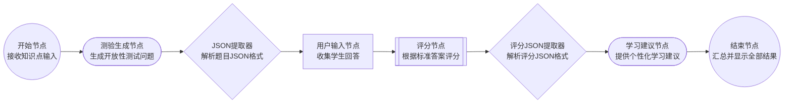

```mermaid
flowchart LR
    A((开始节点<br>接收知识点输入))
    B([测验生成节点<br>生成开放性测试问题])
    C{JSON提取器<br>解析题目JSON格式}
    D[用户输入节点<br>收集学生回答]
    E[[评分节点<br>根据标准答案评分]]
    F{评分JSON提取器<br>解析评分JSON格式}
    G([学习建议节点<br>提供个性化学习建议])
    H((结束节点<br>汇总并显示全部结果))

    A --> B
    B --> C
    C --> D
    D --> E
    E --> F
    F --> G
    G --> H
```