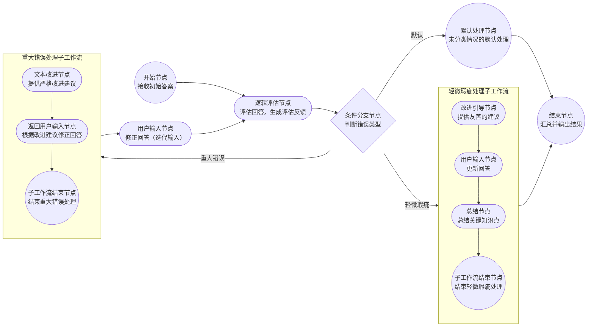

```mermaid
flowchart LR
    %% 主工作流节点
    A((开始节点<br>接收初始答案))
    B([逻辑评估节点<br>评估回答，生成评估反馈])
    C{条件分支节点<br>判断错误类型}
    D([用户输入节点<br>修正回答（迭代输入）])
    
    %% 重大错误处理子工作流
    subgraph MajorDefect [重大错误处理子工作流]
        MD1([文本改进节点<br>提供严格改进建议])
        MD2([返回用户输入节点<br>根据改进建议修正回答])
        MD3((子工作流结束节点<br>结束重大错误处理))
        MD1 --> MD2
        MD2 --> MD3
    end

    %% 轻微瑕疵处理子工作流
    subgraph MinorDefect [轻微瑕疵处理子工作流]
        mD1([改进引导节点<br>提供友善的建议])
        mD2([用户输入节点<br>更新回答])
        mD3([总结节点<br>总结关键知识点])
        mD4((子工作流结束节点<br>结束轻微瑕疵处理))
        mD1 --> mD2
        mD2 --> mD3
        mD3 --> mD4
    end

    %% 默认处理节点和结束节点
    E((默认处理节点<br>未分类情况的默认处理))
    F((结束节点<br>汇总并输出结果))

    %% 主流程连接
    A --> B
    B --> C
    C -- 重大错误 --> MajorDefect
    MajorDefect --> D
    C -- 轻微瑕疵 --> MinorDefect
    MinorDefect --> F
    C -- 默认 --> E
    E --> F
    %% 迭代环路
    D --> B
```