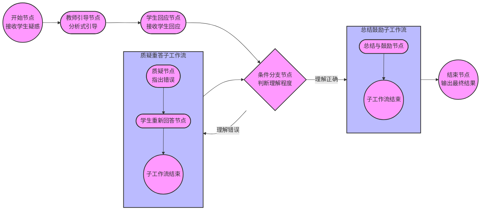

# 苏格拉底工作流程图

```mermaid
flowchart LR
    %% 主工作流节点
    Start((开始节点<br>接收学生疑惑))
    TeacherGuide([教师引导节点<br>分析式引导])
    StudentResponse([学生回应节点<br>接收学生回应])
    BranchNode{条件分支节点<br>判断理解程度}
    
    %% 质疑重答子工作流
    subgraph QuestionFlow [质疑重答子工作流]
        Q1([质疑节点<br>指出错误])
        Q2([学生重新回答节点])
        Q3((子工作流结束))
        Q1 --> Q2
        Q2 --> Q3
    end

    %% 总结鼓励子工作流
    subgraph SummaryFlow [总结鼓励子工作流]
        S1([总结与鼓励节点])
        S2((子工作流结束))
        S1 --> S2
    end

    %% 结束节点
    EndNode((结束节点<br>输出最终结果))

    %% 主流程连接
    Start --> TeacherGuide
    TeacherGuide --> StudentResponse
    StudentResponse --> BranchNode
    BranchNode -- 理解错误 --> QuestionFlow
    QuestionFlow --> BranchNode
    BranchNode -- 理解正确 --> SummaryFlow
    SummaryFlow --> EndNode

    %% 样式设置
    classDef default fill:#f9f,stroke:#333,stroke-width:2px
    classDef subflow fill:#bbf,stroke:#333,stroke-width:2px
    class QuestionFlow,SummaryFlow subflow
```
